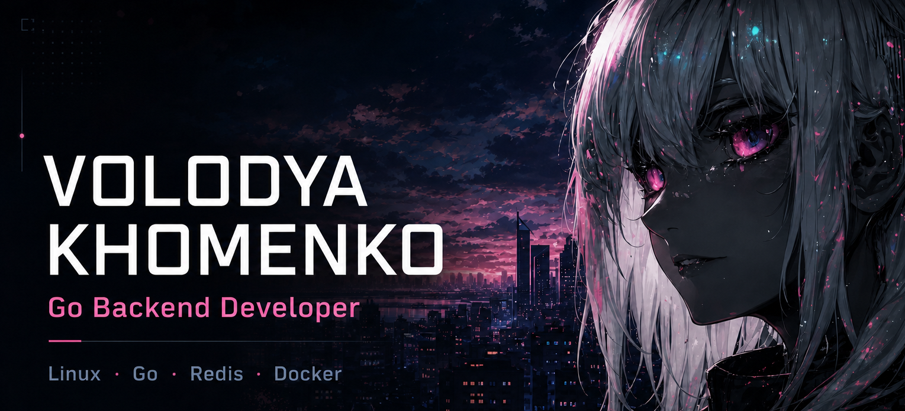
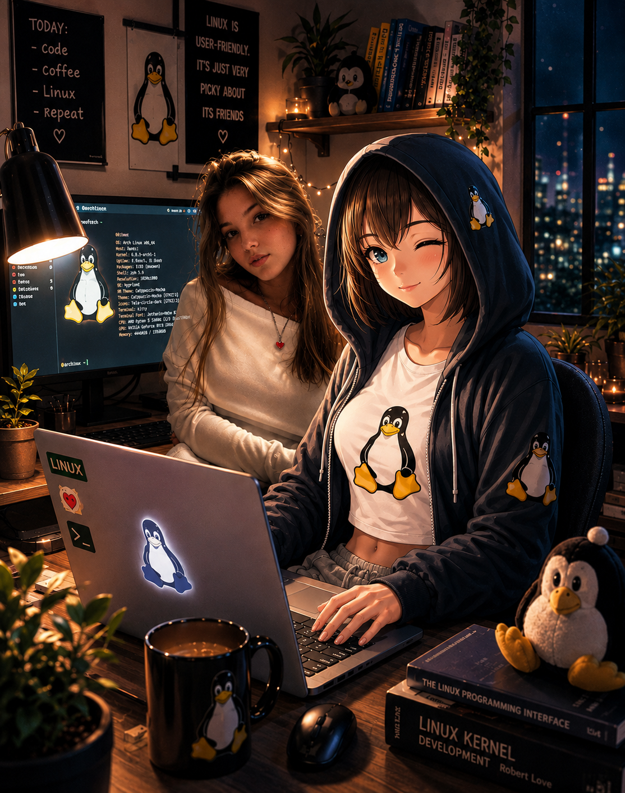

  <picture>
    <source
      media="(prefers-color-scheme: dark)"
      srcset="./VolGit.png"
    >
    <source
      media="(prefers-color-scheme: light)"
      srcset="./VolGitHubLight.png"
    >
    
  </picture>

<table>
<tr>
<td width="50%" valign="top">

### About me
 
Young backend developer with expensive taste in systems and a habit of turning questionable ideas into services that somehow compile.

I like clean Go, late-night debugging, and projects that look innocent until the worker pool wakes up.

Currently building **Alic Online Judge** — because running strangers' C++ code on your server sounded like a perfectly reasonable way to learn queues, isolation and failure handling.
  

Production and I have a complicated relationship: first I promise to behave, then we stay up together until morning trying to remember who removed the limits first.

In code, I prefer strict interfaces, controlled concurrency, and mutual consent between goroutines. Everything else either gets covered by tests or becomes a story best told after the release.

Outside the terminal, I’m still learning to understand distributed systems, production incidents, and girls. So far, only the terminal gives me a clear answer.

</td>
<td width="50%" valign="top">

### Tech stack

  
  
  
  
  
  
  

`REST API` · `Worker pools` · `mTLS` · `CI/CD`

 

  <picture>
    <source
      media="(prefers-color-scheme: dark)"
      srcset="./Lovux.png"
    >
    <source
      media="(prefers-color-scheme: light)"
      srcset="./LovuxLight.png"
    >
    
  </picture>

</td>
</tr>
</table>

## Featured project

### [Alic Online Judge](https://github.com/YourEternalSovereign/alic_online_judge)

Online judge and educational platform with secure asynchronous C++ solution checking.

`API` → `Redis Queue` → `Worker Pool` → `Docker Sandbox` → `MySQL`

- Backend written in Go
- Asynchronous processing through Redis
- Configurable worker pool
- Isolated execution of untrusted code in Docker
- CPU, memory, process and execution-time limits
- Caching and deduplication with TTL
- Administrative API protected with mTLS
- Deployment on a VPS

## GitHub stats

  <picture>
    <source
      media="(prefers-color-scheme: dark)"
      srcset="https://streak-stats.demolab.com?user=YourEternalSovereign&theme=radical&hide_border=true&background=0D1117"
    >
    <source
      media="(prefers-color-scheme: light)"
      srcset="https://streak-stats.demolab.com?user=YourEternalSovereign&theme=default&hide_border=true&background=FFFFFF"
    >
    
  </picture>

  <picture>
    <source
      media="(prefers-color-scheme: dark)"
      srcset="https://github-readme-activity-graph.vercel.app/graph?username=YourEternalSovereign&bg_color=0d1117&color=c9d1d9&line=ff5d9e&point=58a6ff&area=true&hide_border=true"
    >
    <source
      media="(prefers-color-scheme: light)"
      srcset="https://github-readme-activity-graph.vercel.app/graph?username=YourEternalSovereign&bg_color=ffffff&color=24292f&line=d63384&point=0969da&area=true&hide_border=true"
    >
    
  </picture>

